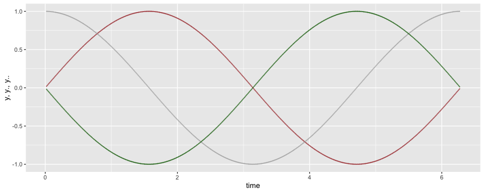

<!-- README.md is generated from README.Rmd. Please edit that file -->

# ForcePlate

<!-- badges: start -->
<!-- badges: end -->

The goal of ForcePlate is to …

## Installation

You can install the development version of ForcePlate from
[GitHub](https://github.com/) with:

``` r
# install.packages("devtools")
devtools::install_github("joergheintz/ForcePlate")
```

Formula


Example:

``` r
library(ForcePlate)
library(ggplot2)
## basic example code
      time = seq(0,6.28, 0.01)
      distance = sin(time)
      df = derivatives(y = distance, t = time)

      df = df[complete.cases(df), ]
      
      head(df)
#>      t           y        y.         y..
#> 2 0.01 0.009999833 0.9999333 -0.00999975
#> 3 0.02 0.019998667 0.9997833 -0.01999850
#> 4 0.03 0.029995500 0.9995334 -0.02999525
#> 5 0.04 0.039989334 0.9991835 -0.03998900
#> 6 0.05 0.049979169 0.9987336 -0.04997875
#> 7 0.06 0.059964006 0.9981839 -0.05996351
```

What is special about using `README.Rmd` instead of just `README.md`?
You can include R chunks like so:

``` r
ggplot(data = df) + 
      geom_point(aes(x = t, y = y ), color = 'brown', alpha = 0.5) + 
      geom_point(aes(x = t, y = y.), color = 'darkgrey', alpha = 0.5)  + 
      geom_point(aes(x = t, y = y.. ), color = 'darkgreen', alpha = 0.5) 
```


