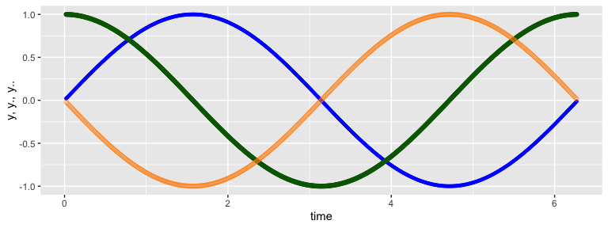

<!-- README.md is generated from README.Rmd. Please edit that file -->

# ForcePlate

<!-- badges: start -->
<!-- badges: end -->

The goal of the ForcePlate package is to extract and process features to
characterize of a recorded stabilogram.

## Installation

You can install the development version of ForcePlate from
[GitHub](https://github.com/) with:

``` r
# install.packages("devtools")
devtools::install_github("joergheintz/ForcePlate")
```

## Example: Derivatives of center point of force displacement

This is a basic example which shows you how to calculate a speed and
acceleration.


``` r
library(ForcePlate)
library(ggplot2)
library(kableExtra)
library(tibble)


## basic example code
      time = seq(0.01,6.28, 0.01)
      distance = sin(time)
      df = derivatives(y = distance, t = time)
      
## output
      as_tibble(rbind(head(df, 3), tail(df, 3)))
#> # A tibble: 6 × 4
#>       t        y    y.     y..
#>   <dbl>    <dbl> <dbl>   <dbl>
#> 1  0.01  0.0100  NA    NA     
#> 2  0.02  0.0200   1.00 -0.0200
#> 3  0.03  0.0300   1.00 -0.0300
#> 4  6.26 -0.0232   1.00  0.0232
#> 5  6.27 -0.0132   1.00  0.0132
#> 6  6.28 -0.00319 NA    NA
```

The function “derivatives” takes time and response as vectors and
returns data frame. The chosen algorithm requires 3 data points to
estimate velocity and acceleration the data set is therefore reduced n -
2 records. The data frame output shows head and tail for the data set
with the NA.

``` r
# remove NA
      df = df[complete.cases(df), ]

# output
      ggplot(data = df) +  
      geom_point(aes(x = t, y = y ), color = 'brown', alpha = 0.5, size = 0.1) + 
      geom_point(aes(x = t, y = y.), color = 'darkgrey', alpha = 0.5, size = 0.1)  + 
      geom_point(aes(x = t, y = y.. ), color = 'darkgreen', alpha = 0.5, size = 0.1) +
            ylab(paste("y, y., y..")) + 
            xlab("time")
```


